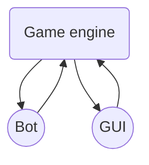

# PRO3600 - Reversi

This project is the "livrable 2" of the computer science project of first year at Telecom SudParis and it aims to create a **Reversi game** on a 8x8 (traditional) grid. For the moment, it is meant to be played by 2 human players.


## Authors

The authors of this project are BRAYE Valérien, PELLEGRIN Margot, THAI Océane and VANKRINKELEN Julien.

## Versions

The current version of the project is suitable for the "livrable 2".
It has been tested for:

 - **Java** versions 11 to 17
 - **JavaFX** version 17
 
 Developed using [Eclipse](https://www.eclipse.org). 
 
 ## How to use this project?

First, you have to make sure that you are using the **latest version of JavaFX** (and that the libraries are in your project folder).
For the moment, you can either play the game in the console or get a preview of what the graphical user interface (GUI) will look in the future, but these two parts are not linked yet, so you cannot play the game from the GUI.

Here is how you can test these two parts:
 - **GUI**: run the project as such and you should see the grid appear. You can click on the buttons to make black and white disks appear, [here is what it should look like](https://imgur.com/a/yhP2SPi).
 - **Game engine**: in [Main.java](./src/application/Main.java):
	 - Uncomment line 38 `testGame.startReversi()`.
	 - Comment line 39 ```launch(args)```.

## What is this project made of?

This project is composed of:
 - The **game engine**, using the following classes:
	 - [Main](./src/application/Main.java)
	 - [Game](./src/application/Game.java)
	 - [GameState](./src/application/GameState.java)
	 - [Move](./src/application/Move.java)
	 - [Position](./src/application/Position.java)
	 - [Color](./src/application/Color.java) (enumeration)
- The **graphical user interface**, using the following files:
	- [SimpleViewCtrl.java](./src/application/) (controller)
	- [SimpleView.fxml](./src/application/) (visual design file generated by SceneBuilder)
- The [assets folder](./src/application/assets), with the images used for the board and the disks.

 The game engine and the GUI are not linked yet, but they do **work individually** :
  - The game engine is fully operational and lets you **play the game in the console**. It creates a GameState instance and checks for valid moves to play until there is none, lets you choose where you want to play and updates the game board according to the [rules of reversi](https://documentation.help/Reversi-Rules/rules.htm).
  - The GUI allows you to **view the board and click to place disks**. It initializes an 8x8 Grid with the 4 central disks. Every other disk is clickable (if you click on it, a disk appears). In the controller : Every graphic element is declared to be able to interact with them (make a disk visible, a button disable etc.). It is composed, for the moment, of a unique `void onClick (MouseEvent event)` method that makes a disk visible on the position we clicked.

## What's next?

In the future, we will link the already existing part, that is to say the GUI and the game engine. We also plan on making a bot to play the game against a human in order to make a solo gamemode.
Here is how the three main parts should interact in the future:


Each part will also be improved in order to be more efficient and easier to use.

01/09/2023 DISCLAIMER : 
I, Julien Vankrinkelen, needed to change my commit email address for every commit on this project. Instead of using "julien.vankrinkelen@telecom-sudparis.eu", I used "julienvankrinkelen@telecom-sudparis.eu", I basically dropped the "."
As a consequence, none of my contributions were showing under my name. I used git rebase to change every single one of my commit with the right email address. This is why the timestamps of almost every commit have been resetted to the day I did this modification.
The project was closed a year ago, so the commit timestamps don't really matter much now. If I have time, one day, I will fix this issue byt applying the timestamps registered in the previous commit. 
